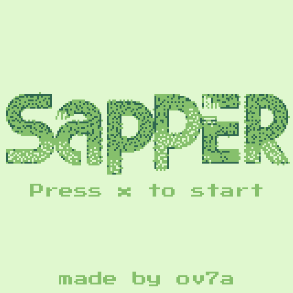
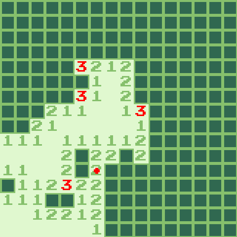

# Sapper

A game written in Nim for the [WASM-4](https://wasm4.org) fantasy console. 

Play [here](https://ov7a.github.io/sapper/).




## Building

WASI SDK, WASM-4, and Nim are required. 
See the [workflow](.github/workflows/deploy.yaml) on how to setup them.

Build by running:

```shell
nimble rel
```

Then run it with:

```shell
nimble play
```
